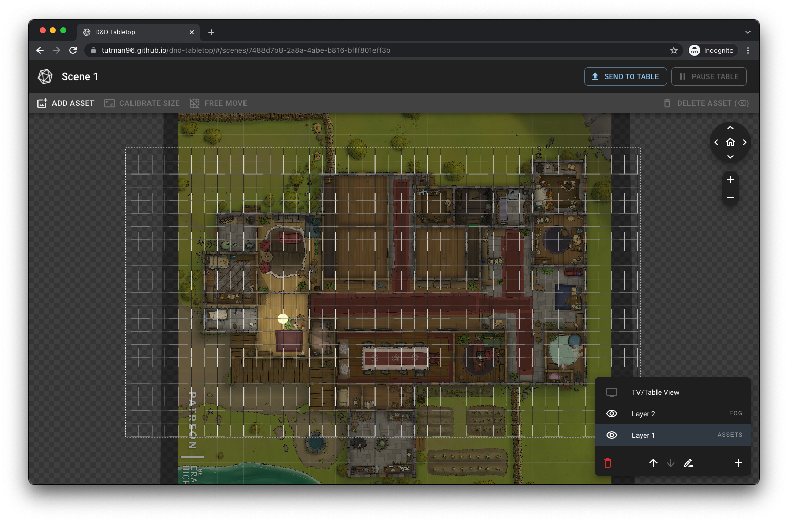

# DND Tabletop

A web app built to allow creation and presentation of table-top roleplay map for in person sessions. It is designed to give the best experience during in-person sessions with a virtual map provided by a TV setup as a map. It provides capabilities such as adding image and video assets to a scene, adding fog to obscure portions of the map from the players, and dynamic lighting to reveal portions of that fog. A scene can be sent to the table and multiple scenes can be created to stage for a session.

